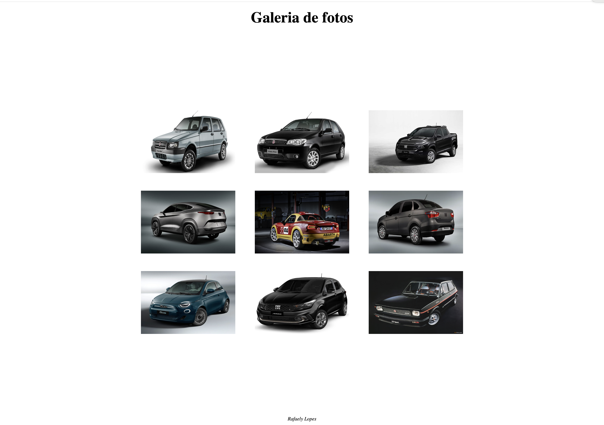

# galeria_flex

## Projeto
Minha primeira galeria, criada durante a disciplina de Linguagem de Marcação do curso de desenvolvimento de sistemas, disponibilizado pelo SENAI Jandira.

## Tecnologias 
* HTML
* CSS
* GIT
* Markdown

## Autor 
[Rafaely Lopes] (https://www.linkedin.com/in/rafaelylopess)
